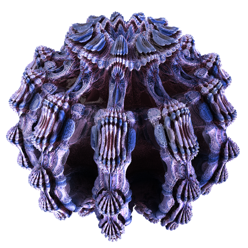
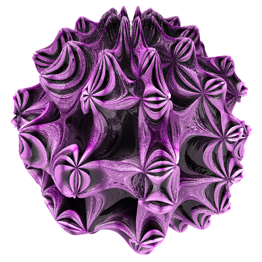

# MandelbulbVariationsGenerator

This supplementary material includes the following files.

* Some samples of our proposed datasets (`samples`)
* Python scripts to generate the datasets (`src`)




## How to run
There are two ways to generate the datasets.

* Rye
* Docker

### Rye

#### Setup `rye`
```
curl -sSf https://rye-up.com/get | bash
```
See [Rye documentation](https://rye-up.com/guide/installation/) for more information.

#### Setup `mvg` command
```
cd MandelbulbVariationsGenerator
rye sync
```

#### Generate **MandelbulbVAR-1k**

```bash
# Show help
rye run mvg mandelbulbvariations --help
# Minimum working example
rye run mvg mandelbulbvariations --n_per_class 2 --power_min 7 --power_max 8 --rules 488,507 --out out/mandelbulbvariations --width 128 --height 128
# Command to generate the dataset for pre-training
rye run mvg mandelbulbvariations --n_per_class 1000 --power_min 2 --power_max 18 --rules 107,106,263,334,205,271,434,225,331,413,141,167,424,196,222,461,488,109,151,232,42,188,507,32,451,132,190,481,143,96,180,388,397,68,135,197,360,40,465,243,506,160,327,175,105,223,198,332,452,174,281,395,238,386,161,168,204,416,244,418,297 --out out/mandelbulbvariations
```

#### Generate **MandelbulbVAR-Hybrid-21k**

```bash
# Show help
rye run mvg hybridmandelbulbvariations --help
# Minimum working example
rye run mvg hybridmandelbulbvariations --n_per_class 2 --power_min 7 --power_max 8 --rules 488,507 --out out/hybridmandelbulbvariations --width 128 --height 128
# Command to generate the dataset for pre-training
rye run mvg hybridmandelbulbvariations --n_per_class 50 --out out/hybridmandelbulbvariations
```

#### Generate illustration for hybrid mandelbulb variations (Fig.3)

```bash
# Show help
rye run mvg hybridmandelbulbvariationsillustration --help
# Minimum working example
rye run mvg hybridmandelbulbvariationsillustration --width 128 --height 128 --out out/hybridmandelbulbvariationsillustration
# Command to generate the dataset for pre-training
rye run mvg hybridmandelbulbvariationsillustration --width 512 --height 512 --out out/hybridmandelbulbvariationsillustration
```

### Docker

```
docker build -t mandelbulb_variations_generator:0.0.1 .
docker run -it --gpus all mandelbulb_variations_generator:0.0.1 mvg <some options described above>
```
